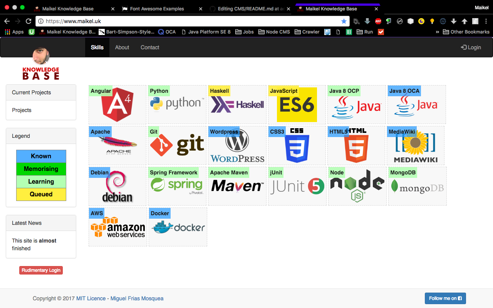
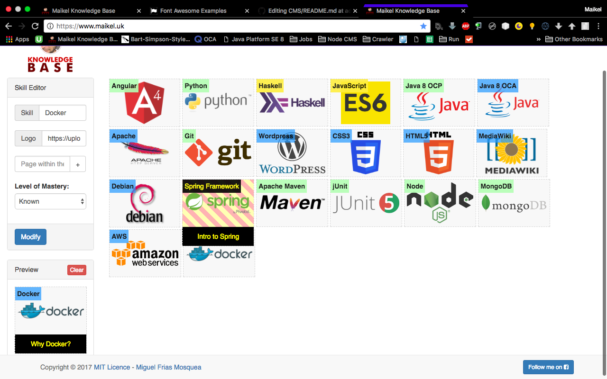
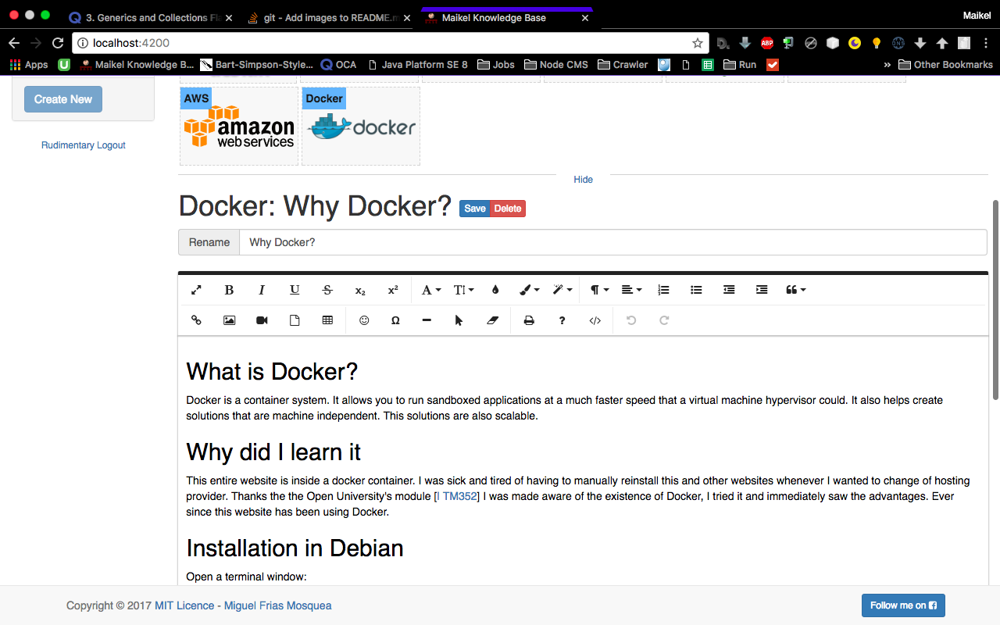

This is a CMS to keep track of your own learning. Instead of dividing it in pages like Wordpress it is divided in skills and each skill in sub-skills. 
It is the evolution of the MediaWiki environment that is now kept for comparison in https://www.maikel.uk/old 

The MediaWiki format has a few shortcomings:
* Editing text is cumbersome.  
* Adding pictures is a hindrance.  
* Adding CSS is an incredible annoyance because you do it globally in Commons.CSS
* Adding Javascript is the same because you do it globally in Commons.JS
* To add a new skill I had to manually create a table each and every time or copy-paste one I already did. 

This CMS automatises or solves all of the previous shortcomings of MediaWiki by:
* Using Froala Editor a WYSIWYG solution. 
* Using Angular for Componentisation of both CSS & Javascript. 
* Automatising the creating of skillboxes. 

This is the way the website looks as of 26th of August of 2017. Due to obvious reasons this picture could be outdated. Check the website itself to see the live latest version http://www.maikel.uk

In visitor-mode:

In editor-mode:

Editing a page:

